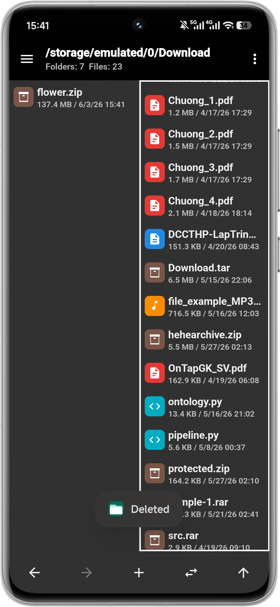

# File Manager

Trình quản lý tệp cho Android, tích hợp sẵn trình xem nội dung, trình duyệt tệp nén và trình soạn
thảo mã nguồn. Ứng dụng duyệt bộ nhớ thiết bị, đọc và ghi các tệp nén (ZIP, 7z, TAR, RAR…), đồng
thời mở ảnh, video, âm thanh và mã nguồn mà không cần rời khỏi ứng dụng.

> Được xây dựng như một dự án học tập: Java 17, kiến trúc phân lớp, dependency injection với Hilt.
> `minSdk 30` (Android 11) · `targetSdk 36`.

||||
|--|--|--|
||||
||||
||||

## Tính năng

- **Duyệt hai khung (dual-pane)** với tự động làm mới khi thư mục thay đổi trên đĩa.
- **Tệp nén như thư mục** — duyệt, chỉnh sửa và tạo ZIP/7z/TAR/CPIO/…, kể cả tệp nén được bảo vệ
  bằng mật khẩu (AES-256) và tệp nén lồng nhau.
- **Trình xem tích hợp** cho ảnh (Glide), video/âm thanh (Media3/ExoPlayer) và trình soạn thảo mã
  nguồn với tô sáng cú pháp TextMate (sora-editor).
- **Thùng rác** (xóa mềm, có thể khôi phục) và **dấu trang (bookmark)**, lưu bằng cơ sở dữ liệu Room.
- **Tìm kiếm** theo tên trong cả cây thư mục, và **sao chép/di chuyển** giữa mọi nguồn — kể cả vào và
  ra khỏi tệp nén.
- Giao diện sáng/tối và tùy chỉnh cách sắp xếp.

## Công nghệ sử dụng

| Hạng mục | Thư viện |
|--------|---------|
| DI | Hilt (Dagger) |
| Cơ sở dữ liệu | Room |
| Tải ảnh | Glide |
| Phát đa phương tiện | AndroidX Media3 / ExoPlayer |
| Trình soạn thảo mã | rosemoe sora-editor + TextMate |
| Tệp nén | libarchive (`me.zhanghai.android.libarchive`) |
| Cài đặt | SharedPreferences |

## Kiến trúc

Toàn bộ ứng dụng xoay quanh ba trừu tượng: **`Path`** (địa chỉ ảo), **`Storage`** (một backend:
thiết bị, tệp nén, thùng rác, dấu trang, tìm kiếm) và **`Handler`** (cách một tệp được mở). Phần giao
diện chỉ giao tiếp với `StorageFacade`, nơi định tuyến một path tới đúng storage và handler của nó.

Xem [`docs/FEATURES.md`](docs/FEATURES.md) để biết chi tiết cách từng phần hoạt động theo từng tính năng.

## Build & chạy

```bash
git clone https://github.com/vpthinh19/file-manager.git
cd file-manager
./gradlew installDebug   # hoặc mở dự án trong Android Studio
```

Yêu cầu Android SDK với API 36 và một thiết bị/máy ảo chạy Android 11 trở lên.
Ở lần khởi chạy đầu tiên, ứng dụng sẽ yêu cầu quyền **Truy cập tất cả tệp** (`MANAGE_EXTERNAL_STORAGE`).

## Giấy phép

[MIT](LICENSE) © Phúc Thịnh
