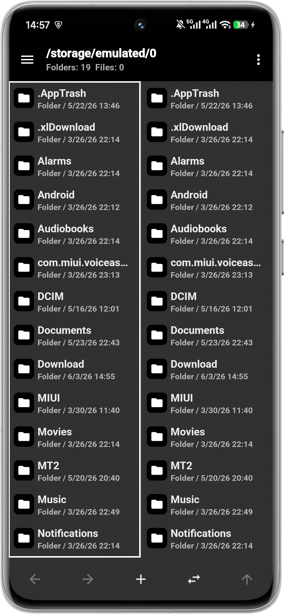
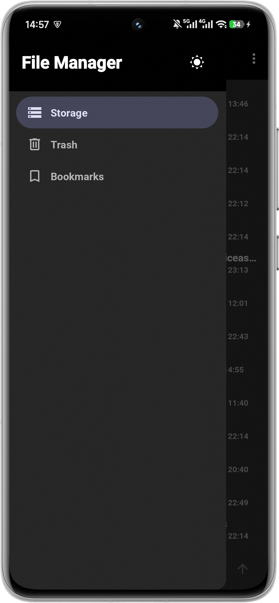
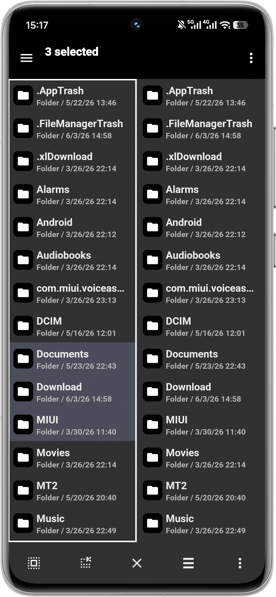
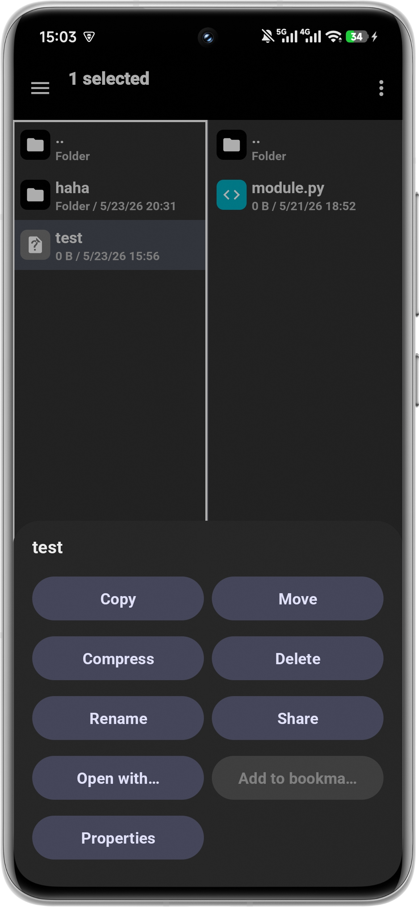
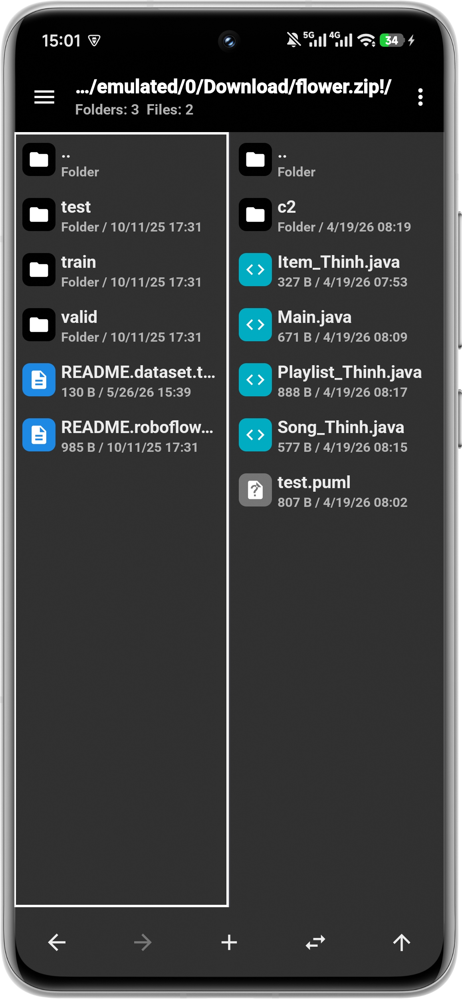
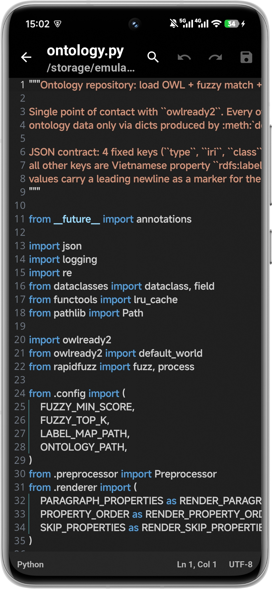
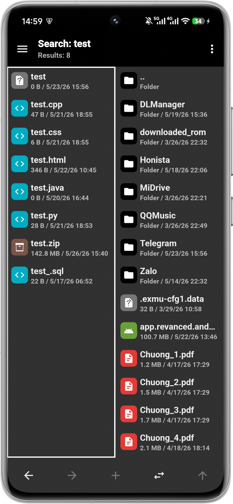
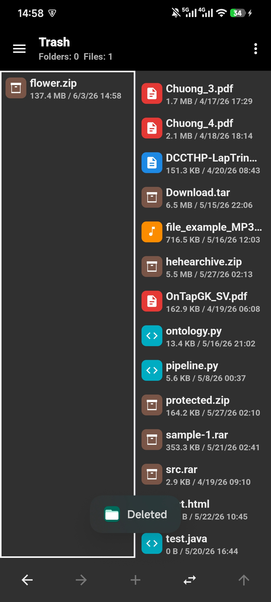
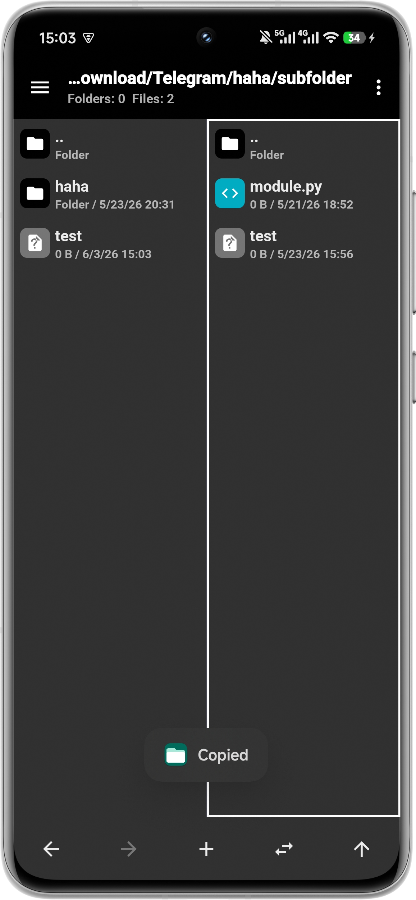

# File Manager

A file manager for Android with built-in viewers, an archive browser, and a code editor.
It browses device storage, reads and writes compressed archives (ZIP, 7z, TAR, RAR…), and opens
images, video, audio and source code without leaving the app.

> Built as a learning project: Java 17, layered architecture, dependency injection with Hilt.
> `minSdk 30` (Android 11) · `targetSdk 36`.

|||
|--|--|
||||
||||
||||

## Features

- **Dual-pane browsing** with live refresh when folders change on disk.
- **Archives as folders** — browse, edit and create ZIP/7z/TAR/CPIO/…, including password-protected
  (AES-256) and nested archives.
- **Built-in viewers** for images (Glide), video/audio (Media3/ExoPlayer) and a code editor with
  TextMate syntax highlighting (sora-editor).
- **Trash** (soft delete with restore) and **bookmarks**, backed by a Room database.
- **Search** by name across a folder tree, and **copy/move** between any sources — even in and out
  of archives.
- Light/dark theme and configurable sorting.

## Tech stack

| Concern | Library |
|--------|---------|
| DI | Hilt (Dagger) |
| Database | Room |
| Image loading | Glide |
| Media playback | AndroidX Media3 / ExoPlayer |
| Code editor | rosemoe sora-editor + TextMate |
| Archives | libarchive (`me.zhanghai.android.libarchive`) |
| Settings | SharedPreferences |

## Architecture

The whole app is built around three abstractions: **`Path`** (a virtual address), **`Storage`**
(a backend: device, archive, trash, bookmarks, search) and **`Handler`** (how a file opens). The UI
talks only to `StorageFacade`, which routes a path to its storage and handler.

See [`docs/FEATURES.md`](docs/FEATURES.md) for a feature-by-feature breakdown of how each part works.

## Build & run

```bash
git clone https://github.com/vpthinh19/file-manager.git
cd file-manager
./gradlew installDebug   # or open the project in Android Studio
```

Requires the Android SDK with API 36 and a device/emulator running Android 11+.
On first launch the app requests **All files access** (`MANAGE_EXTERNAL_STORAGE`).

## License

[MIT](LICENSE) © Phúc Thịnh
